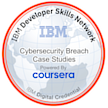
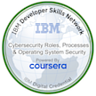
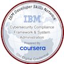

 ALPHA TEAM 

  

 👋 Greetings 

 Welcome to my GitHub Playground 

 

 
## 👨‍💻 About Me
 
### 🔍 Role: 
AI Data Analyst focused on data annotation, labeling, and analysis.
 
### 🎯 Current Focus: 
Transitioning into a specialized AI career by diving into new programming languages and tackling innovative projects.
 
### 🌟 Passion: 
Creating impactful solutions with AI, continuous learning, and collaborating with a forward-thinking team.
 
 
### 🛠️ What I Do Here
This repository is my playground where I:
 
* 🤖 Experiment with AI tools and models.
 
* 🧹 Work on data cleaning, analysis, and automation.
 
* 🔧 Build projects like bots, interactive applications, and innovative solutions.
 
* 🗂️ Share team efforts, collaborate, and merge ideas into cohesive projects.
 
* 🌱 Learning & Growth
 
* 📖 Exploring cutting-edge AI tools and trends.
 
* 🖥️ Building my expertise in programming languages like Python and C++.
 
* 💡 Adopting better workflows for collaboration and project management.

## 👨‍💻 Getting to know me

### Plum Assessment Results

I have completed the Plum Talent Assessment, a comprehensive evaluation tool that highlights key strengths, cognitive abilities, and workplace preferences.
Below is a link to my detailed results, showcasing my capabilities in problem-solving, adaptability, innovation, and leadership traits.

[View My Plum Assessment Results](https://secure.plum.io/p/-OovMGXbvUy-yNZVcyxpUQ)

These insights reflect my commitment to understanding and leveraging my strengths for professional growth and aligning with roles that match my skills and interests

 
🤝 Let's Connect!
 
If you're here, you're probably someone who loves to build and explore new ideas—just like me! Feel free to explore my repositories, contribute, or reach out if you'd like to collaborate.
