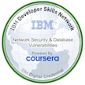
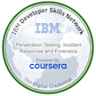
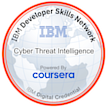
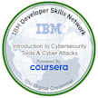

 ALPHA TEAM 

  

 👋 Greetings 

 Welcome to my GitHub Playground 

 

 
## 👨‍💻 About Me
 
### 🔍 Role: 
AI Data Analyst focused on data annotation, labeling, and analysis.
 
### 🎯 Current Focus: 
Transitioning into a specialized AI career by diving into new programming languages and tackling innovative projects.
 
### 🌟 Passion: 
Creating impactful solutions with AI, continuous learning, and collaborating with a forward-thinking team.
 
 
### 🛠️ What I Do Here
This repository is my playground where I:
 
* 🤖 Experiment with AI tools and models.
 
* 🧹 Work on data cleaning, analysis, and automation.
 
* 🔧 Build projects like bots, interactive applications, and innovative solutions.
 
* 🗂️ Share team efforts, collaborate, and merge ideas into cohesive projects.
 
* 🌱 Learning & Growth
 
* 📖 Exploring cutting-edge AI tools and trends.
 
* 🖥️ Building my expertise in programming languages like Python and C++.
 
* 💡 Adopting better workflows for collaboration and project management.

## 👨‍💻 Getting to know me

### CYBER NATIONS FOUNDATION
[Micro-certification: AI Analyst - Introduction to AI](https://certificate.bcdiploma.com/check/4459833E06D51FC0357FE1970213102D9E43CB87E37E0D2D1636A0AC052D247CY1hNdnppWHppaGVRS203NVBQa3N3STlXcW15eGtPM3pPMjg0R1BLay82UkRvbmxt) (July 2024)
### THE G. RAYMOND CHANG SCHOOL OF CONTINUING EDUCATION, TORONTO METROPOLITAN UNIVERSITY
[Micro-certification: AI for Data Analysis](https://curvcred-award.continuing.torontomu.ca/check/C515B06D94E5AAF7B29DF3F9589FC16CE36D0028CF853AB61FFF4A1AE61928E0Tms1SC9IVEJuNGoxMUVMQkdmWGphWnZyMlZ3TDFPZ2RtN2FETnZPaTJRMDZVRCtz) (Jul 2024)
### DataCamp
Take a look at all the courses I’ve completed on DataCamp.
#### Courses
* [Introduction to Python](https://www.datacamp.com/completed/statement-of-accomplishment/course/7bbdefb41d7958a9796ba1e5a912249f507d8ed2)
* [Introduction to SQL](https://www.datacamp.com/completed/statement-of-accomplishment/course/2569211b45fa2fe5d9c90df244ad98f0a44bbc20)
* [Introduction to ChatGPT](https://www.datacamp.com/completed/statement-of-accomplishment/course/9eb35b8b66b24347805bac30e7ddf87e831f3e78)
* [Understanding Artificial Intelligence](https://www.datacamp.com/completed/statement-of-accomplishment/course/fcbe095e15fb63f3fca3bccff7569b6307bbd36d)
* [Understanding Data Science](https://www.datacamp.com/completed/statement-of-accomplishment/course/e6622517886cd6c719a9b9be8c3d35ac9a5d728e)
* [Supervised Learning with scikit-learn](https://www.datacamp.com/completed/statement-of-accomplishment/course/bb6f5c76c22ec1c016831b495188d15f73e95d27)
* [Understanding Machine Learning](https://www.datacamp.com/completed/statement-of-accomplishment/course/8519e4315a8670e443b26a7d759c3cc0b2a236f0)
* [Understanding Prompt Engineering](https://www.datacamp.com/completed/statement-of-accomplishment/course/02315c308c25813dcd973081b00a04a746905e96)
* [Large Language Models (LLMs) Concepts](https://www.datacamp.com/completed/statement-of-accomplishment/course/82bd8f6528f77cbbd4ac28d942bfbf382d06577a)
* [Generative AI Concepts](https://www.datacamp.com/completed/statement-of-accomplishment/course/8580cc069dca45d4a56bcb7d9accc506b55d83a6)
* [AI Ethics](https://www.datacamp.com/completed/statement-of-accomplishment/course/e2d19d477f7dbd08542c939d0d3754831bc4de24)
* [Writing Functions in Python](https://www.datacamp.com/completed/statement-of-accomplishment/course/0dc39fe9a820c817b2b671299d565efa99c4a477)
* [Introduction to Natural Language Processing in Python](https://www.datacamp.com/completed/statement-of-accomplishment/course/0396f25914b603201221ea5d2652dd62688e5ed1)
* [Machine Learning with Tree-Based Models in Python](https://www.datacamp.com/completed/statement-of-accomplishment/course/97a3bc8b50053d75eec531b53bfa9238d39fa698)
* [Introduction to GitHub Concepts](https://www.datacamp.com/completed/statement-of-accomplishment/course/befddf2dcb96abb3f05341ec55fa45a4c9dd7b37)
* [ETL and ELT in Python](https://www.datacamp.com/completed/statement-of-accomplishment/course/31bb9695d92e847aa174fa1c5f6943bb4d4ef0cb)
* [Introduction to Data Quality](https://www.datacamp.com/completed/statement-of-accomplishment/course/2eeda2ae08f52138ca0c5f7bfc8fd36a8d6dcf4d)
* [Implementing AI Solutions in Business](https://www.datacamp.com/completed/statement-of-accomplishment/course/f50bf002a11dc044eb3af72e25890750e0774d83)
* [Introduction to Data Privacy](https://www.datacamp.com/completed/statement-of-accomplishment/course/a010f5fb6a831bb3001624b431fcc93c2785ef5e)
* [Introduction to Data Ethics](https://www.datacamp.com/completed/statement-of-accomplishment/course/b7c3b158fb52350240d1ca36da19015683615512)
* [Explainable Artificial Intelligence (XAI) Concepts](https://www.datacamp.com/completed/statement-of-accomplishment/course/963fef543d2a2c96ec463e02229e720e74cfd346)
* [Sentiment Analysis in Python](https://www.datacamp.com/completed/statement-of-accomplishment/course/3108c1b0b27b9b79439511dd45a4b02c1f51fdc4)
* [Responsible AI Practices](https://www.datacamp.com/completed/statement-of-accomplishment/course/2e09278f688e43f0f7f28b11ffeb880d86d78f1f)
* [AI Security and Risk Management](https://www.datacamp.com/completed/statement-of-accomplishment/course/9677e066507cccc8934beafd6a00469c034a6114)
#### Tracks
* [AI Fundamentals](https://www.datacamp.com/completed/statement-of-accomplishment/track/1d58942e742be60e4d803550cbea453233a120e0)
* [ChatGPT Fundamentals](https://www.datacamp.com/completed/statement-of-accomplishment/track/db43cf4a5d84730936907f26d9c9b1d70eda5645)

### MS-900 Microsoft 365 Fundamentals
* [What is Microsoft 365?](https://learn.microsoft.com/api/achievements/share/en-us/JermaineLucas-6717/3RYLXYPH?sharingId=A33F1A7D2FAD931F)
* [Describe productivity solutions of Microsoft 365](https://learn.microsoft.com/api/achievements/share/en-us/JermaineLucas-6717/P5SZSET4?sharingId=A33F1A7D2FAD931F)
* [Describe collaboration solutions of Microsoft 365](https://learn.microsoft.com/api/achievements/share/en-us/JermaineLucas-6717/QTT4DF5E?sharingId=A33F1A7D2FAD931F)
* [Describe endpoint modernization, management concepts, and deployment options in Microsoft 365](https://learn.microsoft.com/api/achievements/share/en-us/JermaineLucas-6717/N22Y4VLF?sharingId=A33F1A7D2FAD931F)
* [Describe analytics capabilities of Microsoft 365](https://learn.microsoft.com/api/achievements/share/en-us/JermaineLucas-6717/WZZXBGMN?sharingId=A33F1A7D2FAD931F)

### Plum Assessment Results

I have completed the Plum Talent Assessment, a comprehensive evaluation tool that highlights key strengths, cognitive abilities, and workplace preferences.
Below is a link to my detailed results, showcasing my capabilities in problem-solving, adaptability, innovation, and leadership traits.

[View My Plum Assessment Results](https://secure.plum.io/p/-OovMGXbvUy-yNZVcyxpUQ)

These insights reflect my commitment to understanding and leveraging my strengths for professional growth and aligning with roles that match my skills and interests

 
🤝 Let's Connect!
 
If you're here, you're probably someone who loves to build and explore new ideas—just like me! Feel free to explore my repositories, contribute, or reach out if you'd like to collaborate.
